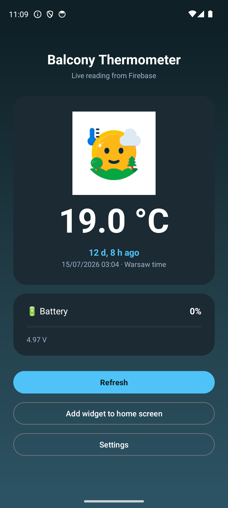

# Balcony Temp

A tiny native Android **app + home‑screen widget** that shows a balcony thermometer's
readings (temperature, last update, battery) from a **Firebase Realtime Database**.

It mirrors the temperature buckets and artwork of the companion web dashboard:
🐫 hot (> 29 °C), a temperate scene (13–29 °C) and a frozen scene (< 13 °C).

## Download

**[⬇️ Download BalconyTemp.apk](https://github.com/mancio/balcony-temp/releases/download/v1.0/BalconyTemp.apk)**
&nbsp;·&nbsp; or browse all [Releases](https://github.com/mancio/balcony-temp/releases/latest).

Sideload it (enable *Install unknown apps* for your browser/file manager).

<p align="center"></p>

## First run — enter your key

The app ships **without any database key**, so nothing private is baked into it.

On first launch it opens **Settings** and asks for your **Firebase Realtime Database URL**,
for example:

```
https://your-project-default-rtdb.europe-west1.firebasedatabase.app
```

- Tap **Test connection** to verify it reads your data.
- Tap **Save** to store it (kept only on your device).
- You can change it any time from **Settings**.

The database is read over the public REST endpoint (`<your-url>/Casina.json`), so no
sign‑in is required as long as your database allows public reads.

## Features

- Live temperature with a weather icon chosen from the reading.
- "Last update … ago" plus the absolute time (Warsaw time).
- Battery % derived from the sensor voltage.
- **If the last update is older than 1 day, the battery is shown as 0%.**
- Home‑screen widget that refreshes on tap and every 30 minutes.
- Pull to refresh; "Add widget to home screen" button.

## Build from source

Requirements: JDK 17 and the Android SDK (API 34).

```bash
./gradlew assembleDebug
# APK: app/build/outputs/apk/debug/app-debug.apk
```

No secrets are needed to build. For local emulator testing you may keep your key in a
git‑ignored `secrets.properties` (`TEMP_DB_KEY=...`) and seed it onto the device — it is
never committed and never included in the APK.

## Tech

Kotlin · View Binding · Coroutines · `AppWidgetProvider` · `HttpURLConnection` + `org.json`.
